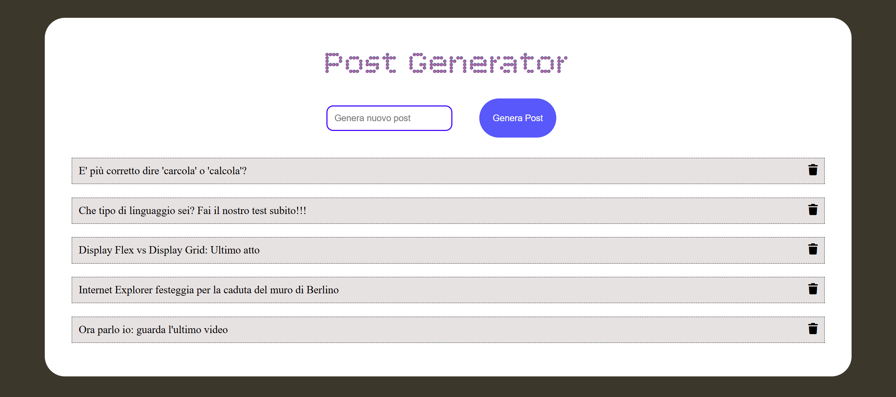

<h1 align="center">React-form</h1>

###

  
  
  
  
  
  
  
  
  

###

###

Esercizio  Milestone 1   Creare una pagina che visualizzi una lista di articoli, mostrandone solo il titolo.  Milestone 2 Aggiungiamo in pagina un semplice form con un campo input in cui inserire il titolo di un nuovo articolo del blog. Al submit del form, mostrare la lista degli articoli aggiornati.  BONUS  Aggiungere la possibilità di cancellare ciascun articolo utilizzando un'icona. passare da array di stringhe a array di oggetti post (ogni post ha id e title).

###

# React + Vite

This template provides a minimal setup to get React working in Vite with HMR and some ESLint rules.

Currently, two official plugins are available:

- [@vitejs/plugin-react](https://github.com/vitejs/vite-plugin-react/blob/main/packages/plugin-react) uses [Babel](https://babeljs.io/) for Fast Refresh
- [@vitejs/plugin-react-swc](https://github.com/vitejs/vite-plugin-react/blob/main/packages/plugin-react-swc) uses [SWC](https://swc.rs/) for Fast Refresh

## React Compiler

The React Compiler is not enabled on this template. To add it, see [this documentation](https://react.dev/learn/react-compiler/installation).

## Expanding the ESLint configuration

If you are developing a production application, we recommend using TypeScript with type-aware lint rules enabled. Check out the [TS template](https://github.com/vitejs/vite/tree/main/packages/create-vite/template-react-ts) for information on how to integrate TypeScript and [`typescript-eslint`](https://typescript-eslint.io) in your project.
